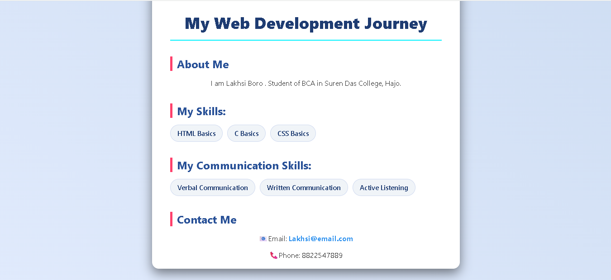

# my-personal-landing-page
My personal portfolio landing page built using HTML and CSS as part of my BCA web development studies.
## About This Project
This is a landing page I built to practice my front-end web development skills. It includes sections for my introduction, current projects,  communication and skills.

## Technologies Used
- HTML
- CSS

## How to View
You can view the project by opening the `aboutme layout.html` file in your browser.

## Screenshot

## Live Demo
https://borolakshi783-coder.github.io/my-personal-landing-page/

## Author

**Name:** Lakshi Boro  
**GitHub:** https://github.com/borolakshi783-coder
